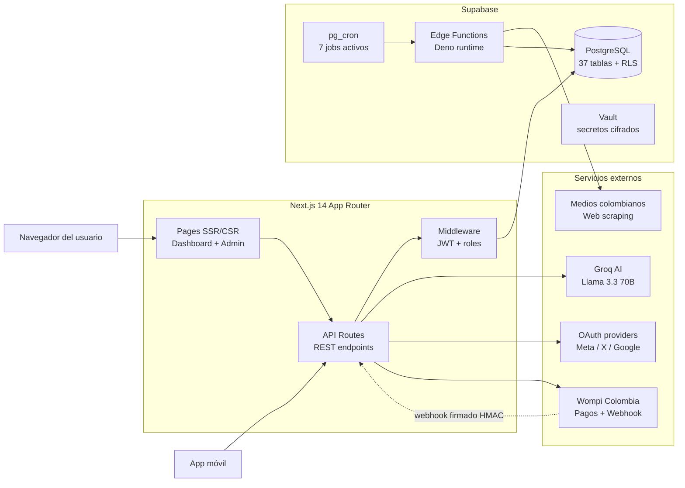

# Reputación Online

> Plataforma SaaS de monitoreo y gestión de reputación digital, orientada al mercado colombiano.

Reputación Online permite a marcas, empresas y figuras políticas medir su presencia en redes sociales y medios de comunicación, detectar crisis reputacionales a tiempo y responder con estrategia. Incluye un asistente conversacional con IA que mantiene contexto entre sesiones y un sistema de planes con créditos prepago integrado a la pasarela Wompi.

---

## Tabla de contenidos

- [Funcionalidades](#funcionalidades)
- [Arquitectura](#arquitectura)
- [Stack técnico](#stack-técnico)
- [Requisitos](#requisitos)
- [Instalación](#instalación)
- [Variables de entorno](#variables-de-entorno)
- [Estructura del proyecto](#estructura-del-proyecto)
- [Scripts disponibles](#scripts-disponibles)
- [Despliegue](#despliegue)
- [Licencia](#licencia)

---

## Funcionalidades

### Monitoreo de redes sociales
Conexión OAuth con **Facebook, X (Twitter), Instagram y YouTube**. Sincronización automática cada 30 minutos para extraer publicaciones, métricas, comentarios y menciones. Soporte multi-cuenta de la misma red social para el plan Enterprise (hasta 8 cuentas conectadas).

### Monitoreo de medios colombianos
Scraping en vivo de los principales medios digitales del país: El Tiempo, El Espectador, Semana, La FM, Caracol, RCN, Blu Radio y otros. Detección de menciones por palabras clave configurables, con histórico de noticias para análisis de tendencias.

### Asistente de IA "Julia"
Asistente conversacional especializado en reputación online con **memoria persistente** entre sesiones. Una sola conversación continua por usuario; recuerda lo que se le pidió aunque pasen días. Saluda máximo una vez por día y conserva contexto para continuar de forma natural. Da recomendaciones estratégicas y analiza situaciones de crisis.

### Análisis de sentimiento
Procesamiento automático de menciones con clasificación positiva, negativa o neutra usando IA. Cálculo de score de reputación agregado y evolución temporal por plataforma.

### Detección de crisis reputacional
Alertas automáticas ante picos de menciones negativas, trending topics hostiles o cobertura mediática crítica. El sistema sugiere protocolos de respuesta según severidad detectada.

### Búsqueda de personas
Análisis reputacional de cualquier figura pública: histórico de menciones, sentimiento agregado y presencia en medios colombianos.

### Sistema de planes y créditos
Cuatro planes (**Free, Basic, Pro, Enterprise**) con límites diferenciados de cuentas conectadas, créditos mensuales y funcionalidades. Renovación automática mensual de créditos vía cron y compra de paquetes adicionales mediante pasarela Wompi con validación HMAC en webhook.

### Panel administrativo
Portal independiente con login dedicado para administradores: gestión de usuarios (crear, actualizar, deshabilitar, resetear contraseña), asignación masiva de créditos, supervisión de pagos, configuración del sistema y consulta de transacciones. Acceso restringido por rol.

---

## Arquitectura



**Flujos principales**:

- **Autenticación**: Cookies HTTP-only con JWT firmado, validado por middleware en cada petición.
- **Sincronización social**: cron `*/30 * * * *` invoca `/api/cron/sync-social-all` que refresca tokens OAuth y descarga métricas a la tabla `social_media`.
- **Scraping de medios**: cron `*/15 * * * *` dispara la Edge Function `scraping-scheduler`, que recorre la `news_sites_catalog` y guarda artículos en `scraped_news`.
- **Renovación de créditos**: cron `0 0 1 * *` ejecuta `renew_monthly_credits()` que resetea créditos al límite del plan de cada usuario.
- **Pagos**: Wompi notifica al webhook `/api/payments/webhook`, validado con HMAC; se acreditan créditos atómicamente y se envía email de confirmación.
- **Julia AI**: el endpoint `/api/julia` carga el historial de la conversación del usuario, lo inyecta junto al contexto del usuario y consulta a Groq Llama 3.3; respuesta y memoria persisten en `amelia_messages`.

---

## Stack técnico

| Capa | Tecnologías |
|---|---|
| **Frontend** | Next.js 14 (App Router), React 18, TypeScript, Tailwind CSS, Radix UI, Framer Motion, GSAP, SWR |
| **Backend** | Next.js API Routes (Node.js 20), Edge Functions de Supabase (Deno) |
| **Base de datos** | Supabase (PostgreSQL 15) con Row-Level Security en todas las tablas, pgvector para embeddings, pg_cron para tareas programadas |
| **Autenticación** | NextAuth.js, JWT con bcryptjs, middleware de Next.js |
| **IA / NLP** | Groq SDK (modelo Llama 3.3 70B Versatile), DeepSeek y OpenAI como respaldo |
| **OAuth** | Facebook Graph API, X API v2, Instagram Graph API, YouTube Data API v3 |
| **Pagos** | Wompi Colombia (REST + webhook firmado HMAC SHA-256) |
| **Email** | Resend |
| **Web scraping** | Cheerio + Edge Functions |
| **Visualización** | Chart.js, Recharts, Leaflet (mapas) |
| **Testing** | Vitest, Testing Library, MSW |
| **Infraestructura** | Coolify (despliegue), Docker (containerización) |

---

## Requisitos

- Node.js **20.x** o superior
- npm **9.x** o superior
- Cuenta de **Supabase** con un proyecto creado y migraciones aplicadas
- Cuenta de **Groq** para el asistente Julia
- Credenciales **Wompi** (sandbox o producción)
- Credenciales OAuth de cada red social a habilitar (opcionales)

---

## Instalación

```bash
# 1. Clonar el repositorio
git clone https://github.com/engel48/Reputaciononlineweb.git
cd Reputaciononlineweb

# 2. Instalar dependencias
npm install

# 3. Configurar variables de entorno
cp .env.example .env.local
# Editar .env.local con las credenciales de Supabase, Groq, Wompi, etc.

# 4. Levantar el servidor de desarrollo
npm run dev
```

La aplicación queda disponible en `http://localhost:3000`.

---

## Variables de entorno

### Obligatorias

| Variable | Descripción |
|---|---|
| `NEXT_PUBLIC_SUPABASE_URL` | URL del proyecto Supabase |
| `NEXT_PUBLIC_SUPABASE_ANON_KEY` | Anon key pública de Supabase |
| `SUPABASE_SERVICE_ROLE_KEY` | Service role key (solo backend) |
| `JWT_SECRET` | Clave para firmar tokens de sesión |
| `NEXTAUTH_SECRET` | Secret usado por NextAuth.js |
| `NEXTAUTH_URL` | URL pública del despliegue (sin barra final) |
| `GROQ_API_KEY` | API key de Groq para el asistente Julia |
| `RESEND_API_KEY` | API key de Resend para envío de emails |

### Pagos (Wompi)

| Variable | Descripción |
|---|---|
| `WOMPI_PUBLIC_KEY` | Llave pública de Wompi |
| `WOMPI_PRIVATE_KEY` | Llave privada de Wompi |
| `WOMPI_EVENTS_SECRET` | Secret para validar webhooks (HMAC SHA-256) |
| `WOMPI_INTEGRITY_SECRET` | Secret para firmar transacciones |

### OAuth (opcionales, una por plataforma a habilitar)

| Variable | Descripción |
|---|---|
| `FACEBOOK_CLIENT_ID` / `FACEBOOK_CLIENT_SECRET` | Facebook for Developers |
| `TWITTER_CLIENT_ID` / `TWITTER_CLIENT_SECRET` | X Developer Platform |
| `INSTAGRAM_CLIENT_ID` / `INSTAGRAM_CLIENT_SECRET` | Instagram Graph API |
| `YOUTUBE_CLIENT_ID` / `YOUTUBE_CLIENT_SECRET` | Google Cloud Console |

Consultar `.env.example` para la lista completa.

---

## Estructura del proyecto

```
Reputaciononlineweb/
├── src/
│   ├── app/
│   │   ├── admin/          Portal administrativo (login + dashboard de admin)
│   │   ├── dashboard/      Portal del usuario final (25 páginas)
│   │   ├── api/            Endpoints REST agrupados por dominio
│   │   ├── login/          Páginas públicas de autenticación
│   │   └── (otras)
│   ├── components/         Componentes React organizados por feature
│   │   ├── admin/          Componentes del panel administrativo
│   │   ├── dashboard/      Componentes del dashboard de usuario
│   │   ├── ui/             Componentes base (Radix + Tailwind)
│   │   └── (otras)
│   ├── context/            Contextos globales: User, Plan, Credits
│   ├── lib/                Servicios, utilidades e integraciones
│   │   ├── supabase-server.ts    Cliente Supabase con service role
│   │   ├── ai-service.ts         Cliente Groq con fallback
│   │   ├── auth-helper.ts        requireAuth, requireRole
│   │   ├── user-context.ts       Construcción de contexto para la IA
│   │   └── (otras)
│   ├── services/           Lógica de negocio de alto nivel
│   ├── types/              Definiciones TypeScript compartidas
│   └── middleware.ts       Protección de rutas y JWT
├── supabase/
│   ├── migrations/         Migraciones SQL versionadas
│   └── functions/          Edge Functions en Deno
├── scripts/                Scripts de mantenimiento (setup DB, healthchecks)
├── public/                 Assets estáticos
├── package.json
├── next.config.js
├── tailwind.config.js
├── tsconfig.json
└── README.md
```

---

## Scripts disponibles

| Comando | Descripción |
|---|---|
| `npm run dev` | Servidor de desarrollo en `http://localhost:3000` |
| `npm run build` | Compilación para producción |
| `npm run start` | Servidor de producción |
| `npm run lint` | Linter de Next.js |
| `npm run test` | Ejecuta el test suite con Vitest |
| `npm run test:run` | Tests sin modo watch |
| `npm run test:coverage` | Tests con reporte de cobertura |
| `npm run clean` | Limpia `.next` y `out` |
| `npm run health:supabase` | Healthcheck de la conexión a Supabase |

---

## Despliegue

El proyecto está pensado para correr sobre **Coolify** apuntando a la rama `main` del repositorio. El `Dockerfile` provee un build multi-etapa optimizado con Next.js standalone. Las migraciones de Supabase se aplican manualmente desde el dashboard del proyecto o vía CLI (`supabase db push`).

Variables sensibles (Supabase service role, Wompi private key, OAuth secrets) deben configurarse exclusivamente como variables de entorno del servicio de despliegue. Nunca commitear `.env.local` ni archivos con secretos.

---

## Licencia

ISC License.
